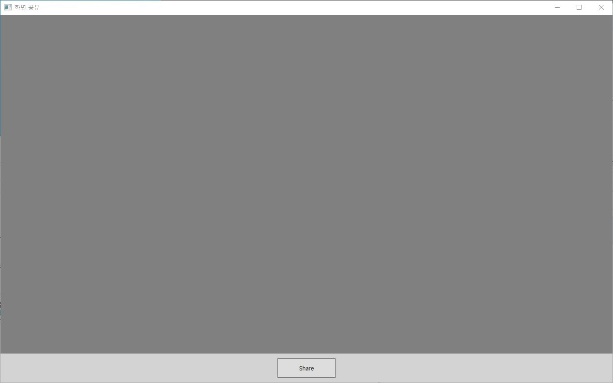

### Zoom의 전체 화면 공유 및 프로세스 화면 공유 기능 구현

------------------------

1. 실행중인 프로세스 목록을 가져온다.

   C#의 **Process.GetProcesses()** 메서드는 백그라운드에서 동작하는 프로세스를 가져오고 어떤 프로세스가 Background app인지 확인이 불가하여 Win32API기능인 **EnumDesktopWindows** 을 이용하여 프로세스 목록을 가져온다.

   그러나 프로세스 목록을 가져오게 되어도 윈도우10의 UWP앱같은 경우 프로세스 상태가 CLOCKED상태로 있어 사용자에게는 보이지 않으나 프로세스 목록에 출력되는 현상이 있음

   > 이 문제를 해결하기 위해  Dwmapi.dll의 **DwmGetWindowAttribute**함수를 이용하여 CLOCKED상태인 프로세스를 처리할 수 있었다.

2. 프로세스 or 전체화면 캡쳐하기

   **FindWindow**함수를 이용해 프로세스의 핸들을 가져온 후 Graphic 객체를 이용해 Bitmap으로 그려주는 방법을 사용하였지만 이는 크롬이나 파이어폭스같은 웹 브라우저같이 하드웨어 가속화가 되있는 경우 캡쳐하지 못하였다.

   > 이 문제를 해결하기 위해 **PrintWindow**함수의 flag값을 2로 주게 되니 간단히 해결하였다.

3. MVVM 패턴을 이용해 프로젝트 구현
   1. 시작화면

   2. 전체화면 선택 화면

   3. 프로세스 선택 화면

   4. 윈도우 탐색기 선택 화면

   5. 전체화면 선택 화면

